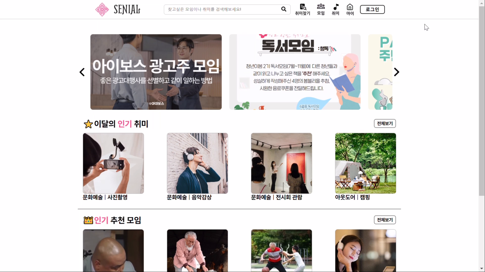
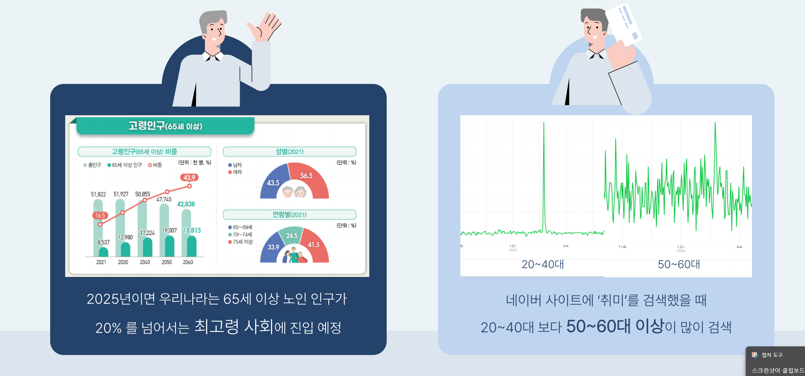
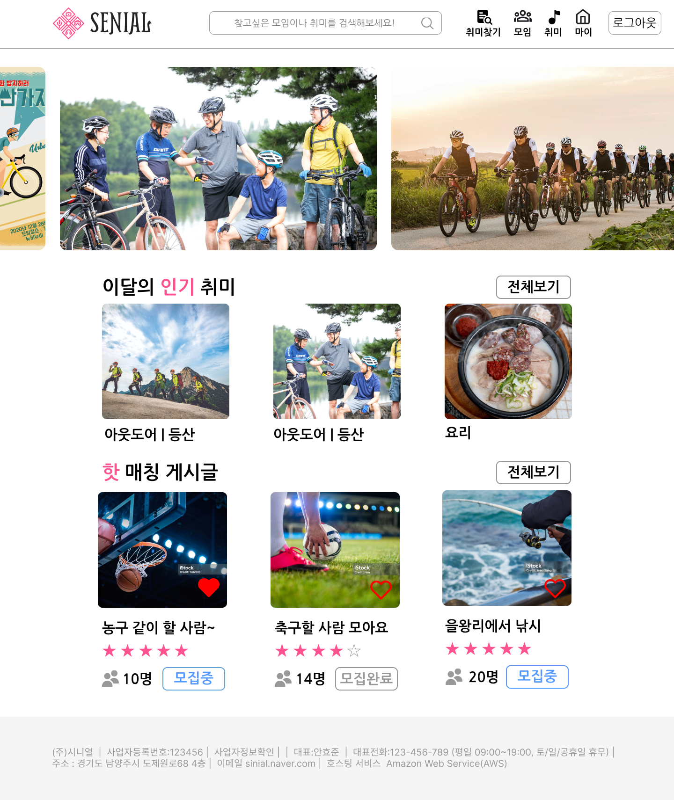
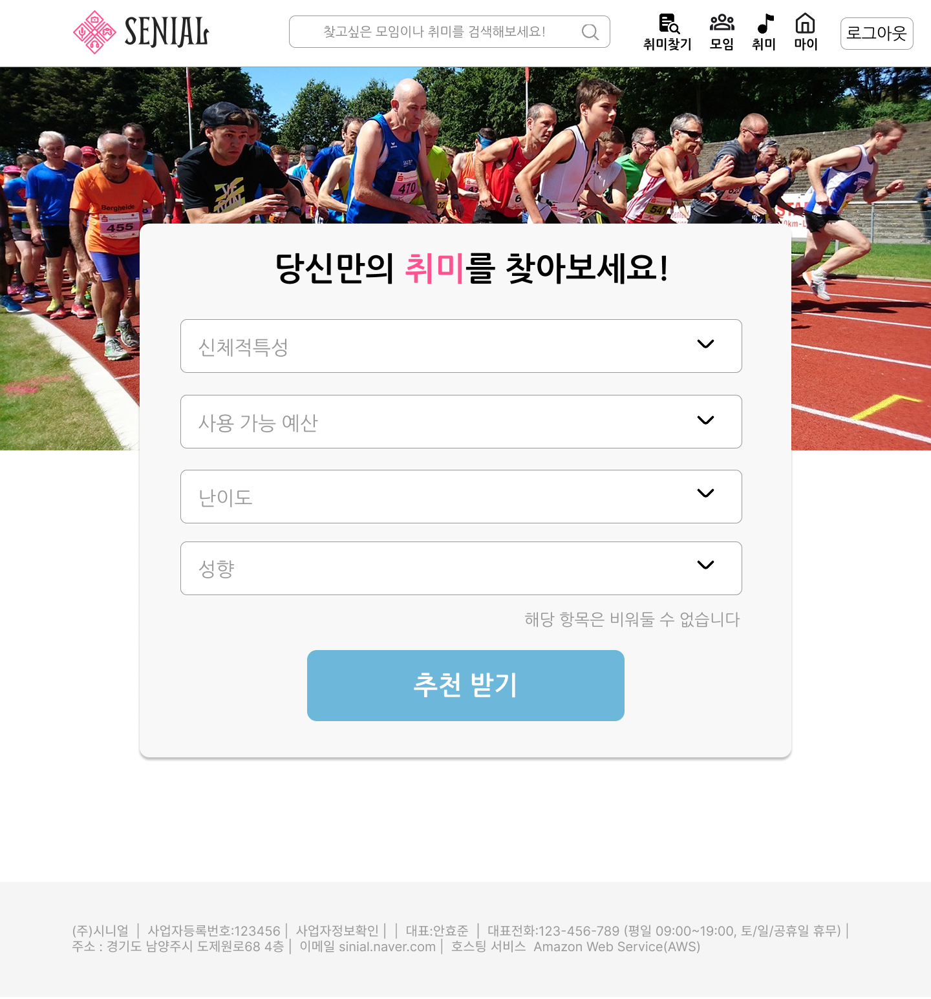
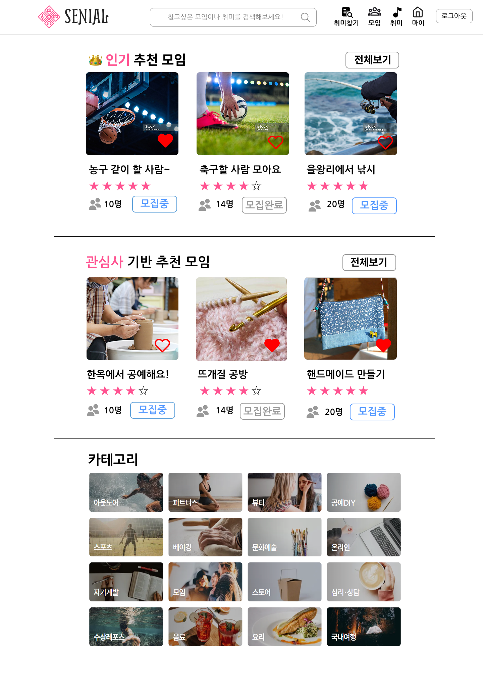
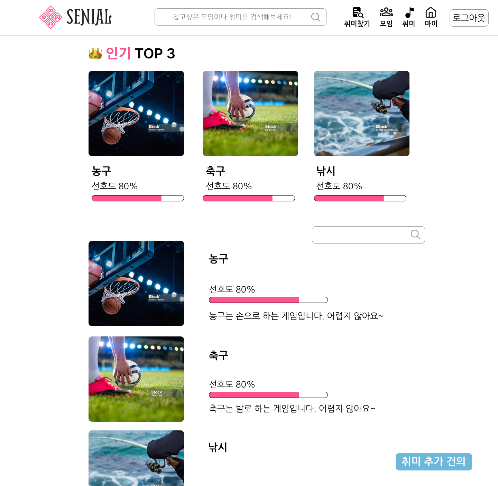
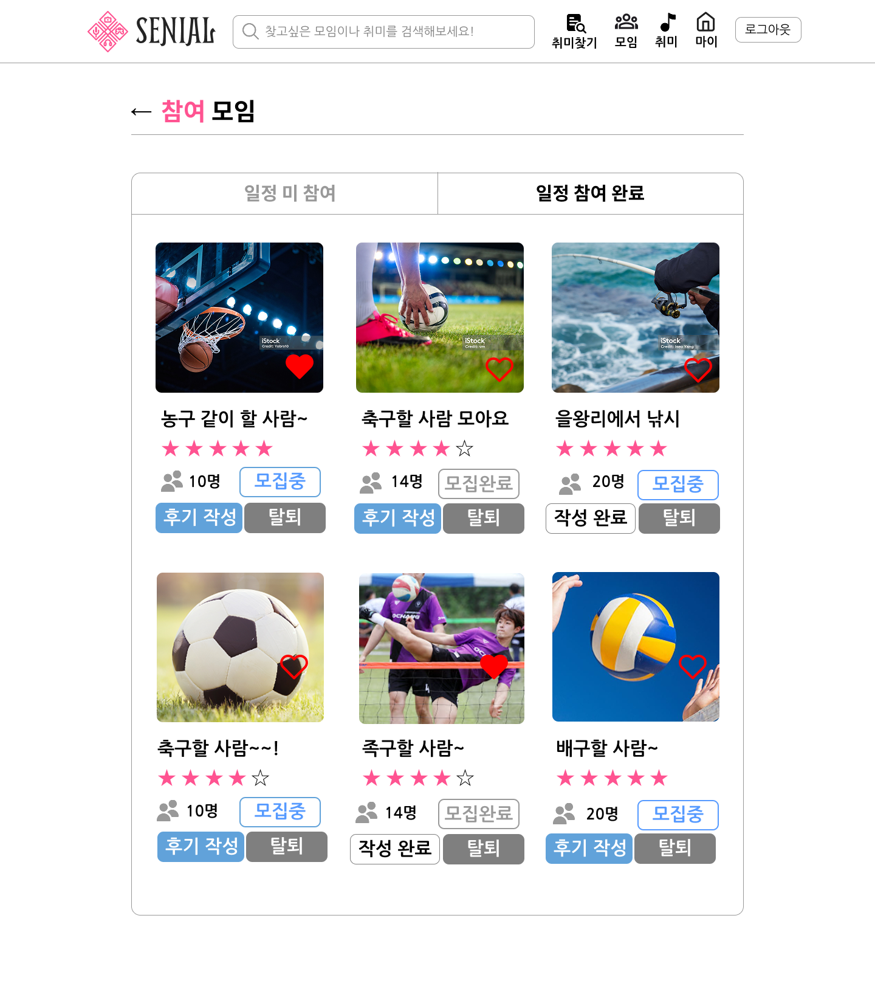
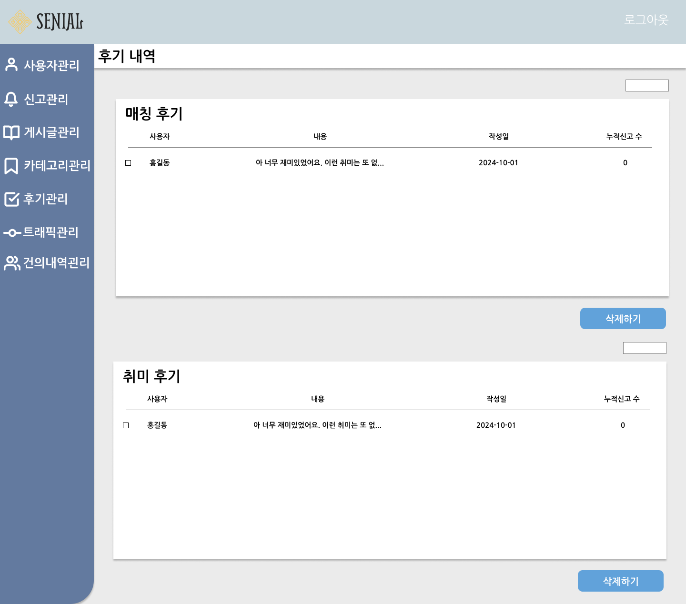
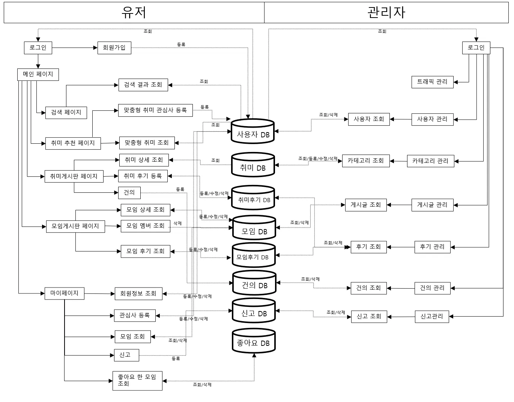

# 시니얼

 

## 시니얼 프로젝트 소개
### 프로젝트명: 시니얼 맞춤 취미 매칭 서비스
#### 자신의 취미를 가지지 못해 무기력하게 살아가는 시니어들을 위한 맞춤형 취미 추천과 동호회 또는 취미 집단 매칭 웹 서비스

## 🔧팀원 구성

| **김상익** | **도영익** | **배민서** | **안효준** |
| :------: |  :------: | :------: | :------: |
|[   @GTU9](https://github.com/GTU9)|[   @do0ik](https://github.com/do0ik) |[   @min-g126](https://github.com/min-g126) | [   @hyojunahn111](https://github.com/hyojunahn111) |

 

## 시니얼 프로젝트 개요

#### **제안 배경**:
- 가족들을 위해서 열심히 일을 하시며 달려오시던 부모님들이 50~60대가 되시면서 직장에서 은퇴를 하시게 되었다. 그리고 일에 치여 살면서 자신의 시간을 가지지 못했던 부모님들은 은퇴를 하시며, 자신만의 시간을 가질수 있게 되었다. 하지만 직장에 다니실 때 힘들어서 텔레비전을 보거나 유튜브를 보는 것에 익숙해져서, 시간을 전과 똑같이 사용하시는 분들이 많다.  이와 같은 문제는 지속적인 무기력과 우울증을 초래한다.

#### **프로젝트 목표**:
- 취미에 대한 정보 소개와 맞춤형 취미 추천 그리고 의견을 나눌수 있는 서비스를 제공한다.
- 활동적인 취미와 사람들과 어울리는 활동을 가지게 참여를 촉진시킨다.
- 오프라인을 통한 해결은 한계가 있기 때문에 온라인 웹사이트를 통해 자신에게 맞춤형 취미를 추천하고 사람들과 매칭을 통해 문제를 해결한다.

#### **기대효과**:
- 현재 정년퇴직을 한 중장년층은 근무중인 중장년층보다 우울증 발생률이 일반적으로 높다. 그렇지만 취미를 가지고 있는 고령자는 일반적인 고령자보다 우울증 발생할 확률이 10퍼센트이상 낮아진걸로 나타난다. 자신에게 알맞고 즐길 수 있는 취미를 찾아 줌으로서 은퇴를 한 중장년층의 심신을 치료하고, 활력을 되찾아 줄 수 있는 기회가 될 수 있다.

 

## **구성 도메인 및 주요 기능**:
#### 메인

- 시니어를 위한 취미 추천과 모임 매칭 서비스를 제공하는 메인 페이지
- 다양한 취미 정보를 한눈에 보고, 함께할 사람을 쉽게 찾을 수 있다.
 
 
#### 맞춤형 취미 추천

- 사용자의 신체적 특성, 예산, 성향 등을 기반으로 맞춤형 취미를 추천해주는 페이지
- 간단한 선택만으로 자신에게 꼭 맞는 취미를 손쉽게 찾아볼 수 있다.
 
 

#### 매칭게시판

- 시니어의 관심사와 인기 취미를 기반으로 다양한 모임을 추천해주는 페이지
카테고리별로 취미 모임을 탐색하며 새로운 사람들과 교류할 수 있다.
 
 

#### 취미게시판

- 시니어들의 취미 선호도를 기반으로 인기 TOP 3 취미를 보여주는 페이지
- 각 취미의 상세 설명과 선호도를 확인하며 새로운 취미를 탐색할 수 있다
 
 

#### 마이페이지  + 캘린더

- 회원의 정보를 조회, 관리 그리고 자신이 참여한 일정의 관리
 
 

#### 관리 기능

- 해당 웹의 전체적인 관리
 

## 💻개발환경

<table>
  <tr>
    <th>Language</th>
    <th>Development</th>
    <th>Backend</th>
    <th>Frontend</th>
    <th>DataBase</th>
    <th>Collaboration Tool</th>
  </tr>
  <tr>
    <td>
        
        
    </td>
    <td>
      
       
    </td>
    <td>
       
    </td>
    <td>
      
    </td>
    <td>
      
    </td>
    <td>
        
        
        
        
        
    </td>
  </tr>
</table>

 

## 🗓️개발 과정 타임라인

 

## 🌳시스템 흐름도

- main 브랜치와 feature 개인 브랜치로 나눠서 운용
- **main** 브랜치는 배포 단계에서만 사용하는 브랜치
- **feature** 브랜치는 각 구현 단위로 구분하여 사용
- **feature** 브랜치를 개인 브랜치 커밋 및 테스트

 

## 📌ERD

 
