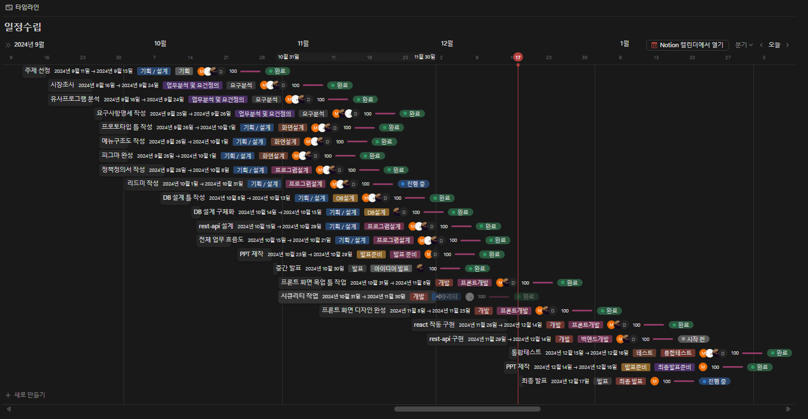
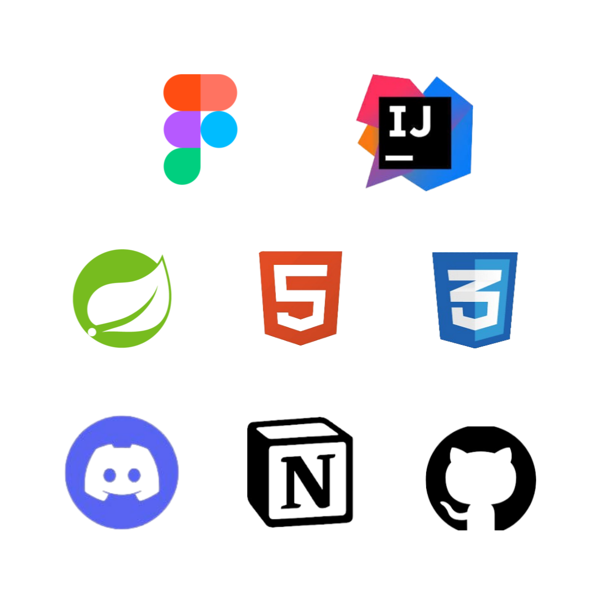
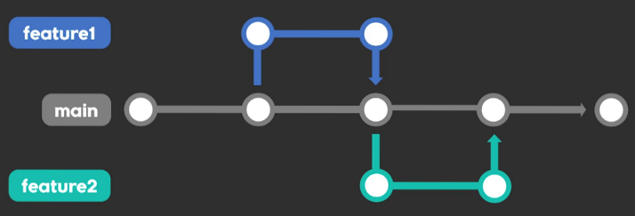
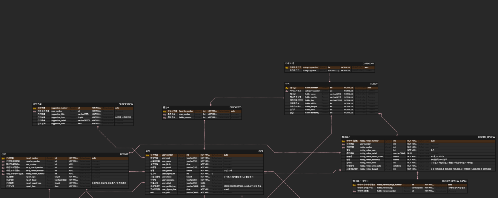
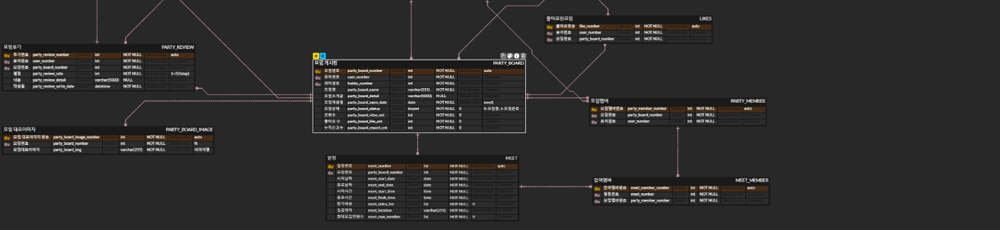

# 시니얼

 

## 시니얼 프로젝트 소개
#### 프로젝트명: 시니얼 맞춤 취미 매칭 서비스
1. 자신의 취미를 가지지 못해 무기력하게 살아가는 시니어들을 위한 맞춤형 취미 추천과 동호회 또는 취미 집단 매칭 웹 서비스
  

### <시니 프로젝트 기획>

#### **제안 배경**:
- 가족들을 위해서 열심히 일을 하시며 달려오시던 부모님들이 50~60대가 되시면서 직장에서 은퇴를 하시게 되었다. 그리고 일에 치여 살면서 자신의 시간을 가지지 못했던 부모님들은 은퇴를 하시며, 자신만의 시간을 가질수 있게 되었다. 하지만 직장에 다니실 때 힘들어서 텔레비전을 보거나 유튜브를 보는 것에 익숙해져서, 시간을 전과 똑같이 사용하시는 분들이 많다.  이와 같은 문제는 지속적인 무기력과 우울증을 초래한다.

#### **기획목표**:
- 위의 문제를 해결하고자 활동적인 취미와 사람들과 어울리는 활동을 가지는 것이 바람직하다.
- 오프라인을 통한 해결은 한계가 있기 때문에 온라인 웹사이트를 통해 자신에게 맞춤형 취미를 추천하고 사람들과 매칭을 통해 문제를 해결한다.

#### **기능요구사항**:
- 웹사이트 내에서 사용자의 성향과 상황에 따라 맞춤형 취미를 추천해준다.
- 웹사이트 내에서 특정 취미에 대해서 선호도를 표시하고, 해당 취미를 가진 사람들의 후기를 등록하거나 조회 할 수 있다.
- 웹사이트 내에서 특정 취미를 목표로 하는 집단이나 동호회를 만들거나 참여하고 활동할 수 있다.
- 웹사이트 내에서 회원은 취미 활동을 위한 스케줄을 조정하거나, 관심 있는 취미 집단이나 참여한 취미 집단을 관리할 수 있다.
- 웹사이트 내에서 관리자는 회원 관리와 취미에 관한 데이터베이스 조작이 가능하다.

#### **구성 도메인**:
- 메인페이지 - 각 도메인으로 연결, 프로젝트의 메인 페이지
- 맞춤형 취미 추천 - 자신의 환경과 성향을 토대로 취미를 추천
- 매칭게시판 - 모임을 개설하고, 모임의 일정을 만들거나 참여
- 취미게시판 - 특정 취미에 관해서 의견을 나누거나 평가
- 회원 로그인 - 회원들의 로그인, 회원가입 기능
- 마이페이지  + 캘린더 - 회원의 정보를 조회, 관리 그리고 자신이 참여한 일정의 관리
- 관리자 - 해당 웹의 전체적인 관리

   

## 🔧팀원 구성

| **김상익** | **도영익** | **배민서** | **안효준** |
| :------: |  :------: | :------: | :------: |
|[   @GTU9](https://github.com/GTU9)|[   @do0ik](https://github.com/do0ik) |[   @min-g126](https://github.com/min-g126) | [   @hyojunahn111](https://github.com/hyojunahn111) |

   

## 🗓️개발 과정 타임라인

   

## 💻개발환경

 
  

<h4>협업 툴</h4>

 

 
 
 

## 🌳브랜치 전략
### _Trunk-based_

- main 브랜치와 feature 개인 브랜치로 나눠서 운용
- **main** 브랜치는 배포 단계에서만 사용하는 브랜치
- **feature** 브랜치는 각 구현 단위로 구분하여 사용
- **feature** 브랜치를 개인 브랜치 커밋 및 테스트

 
 
 

## 📌ERD

 
 
 
