<div align="center">

# 📖 시니얼 (Senials)

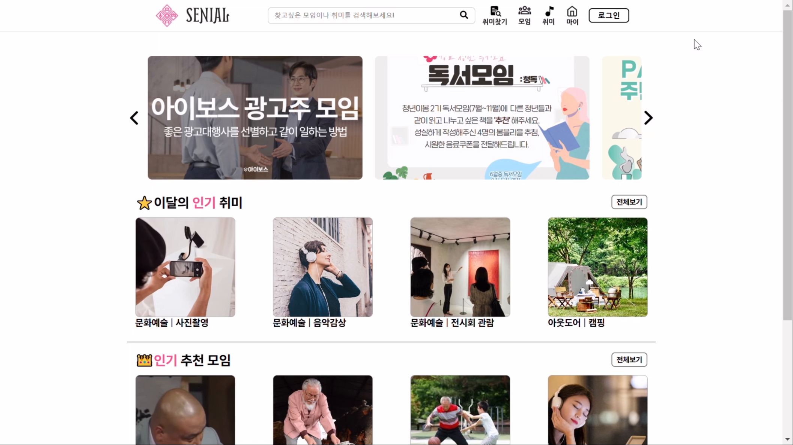

**시니어를 위한 맞춤 취미 추천과 모임 매칭 웹 서비스**

[](https://gtukim.duckdns.org/senials)

</div>

<br>

## 프로젝트 소개

시니얼은 은퇴 후 취미를 찾기 어려운 시니어 분들을 위해 만든 웹 서비스입니다.

신체적 특성, 예산, 난이도, 성향 같은 간단한 항목을 선택하면 그 사람에게 맞는 취미를 추천해 줍니다.
같은 취미를 가진 사람들이 모이는 모임을 찾아 가입하고, 모임 일정을 캘린더로 관리하고,
취미와 모임에 대한 후기를 남기는 것까지 한 곳에서 할 수 있습니다.

<br>

## 기획 배경

오랫동안 일하시던 부모님 세대가 은퇴를 하면 시간이 갑자기 많아집니다.
그런데 막상 무엇을 해야 할지 몰라서 TV나 유튜브만 보며 지내는 경우가 많습니다.
이런 생활이 이어지면 무기력해지기 쉽고, 우울감으로 이어지기도 합니다.

취미가 있는 시니어는 그렇지 않은 분들보다 우울증을 겪을 확률이 낮다고 합니다.
그래서 "자기에게 맞는 취미를 쉽게 찾고, 사람들과 함께할 수 있으면 좋겠다"는 생각으로
시니얼을 기획했습니다.

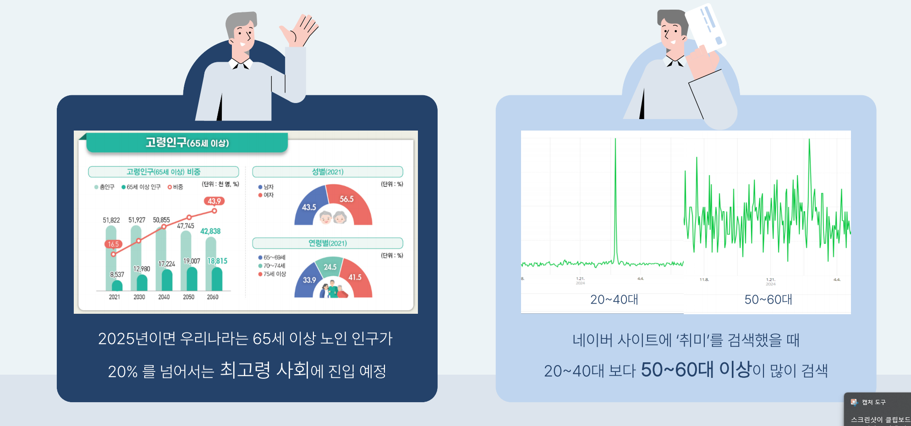

<br>

## 데모 체험

아래 주소에서 바로 사용해 볼 수 있습니다.

- 서비스 주소 : https://gtukim.duckdns.org/senials

회원가입 후 로그인하면 추천부터 모임 가입, 캘린더까지 모든 기능을 이용할 수 있습니다.

<br>

## 1. 개발 환경

| 구분 | 기술 |
|------|------|
| 백엔드 |     |
| 프론트엔드 |     |
| 데이터베이스 |  |
| 인증 |  |

- 인증은 JWT 토큰 방식으로 처리해 세션 없이 로그인 상태를 유지합니다.
- 백엔드는 회원, 모임, 취미, 카테고리, 신고 등 도메인별로 패키지를 나눠 구성했습니다.
- 모임 대표 이미지와 프로필 사진은 파일 업로드로 받아 서버에 저장합니다.
- 프론트엔드는 React + Redux Toolkit으로 화면과 로그인 상태를 관리합니다.

<br>

## 2. 주요 기능

| 기능 | 내용 |
|------|------|
| 회원 / 인증 | 회원가입, 로그인(JWT), 프로필 수정, 회원 탈퇴 |
| 맞춤 취미 추천 | 4가지 항목 선택 → 맞춤 취미 추천 → 관심사 등록 |
| 모임(매칭) | 모임 생성·검색·가입·탈퇴, 일정 관리, 후기, 찜 |
| 취미 | 카테고리별 취미, 인기 TOP3, 취미 후기 |
| 마이페이지 | 참여/생성/찜한 모임, 관심사, 캘린더 |
| 관리자 | 사용자·신고·건의·카테고리 관리 |
| 검색 | 모임과 취미 통합 검색 |

<br>

### [메인 페이지]

- 내 관심사를 기반으로 추천 모임과 인기 모임을 함께 보여 줍니다.
- 카테고리별로 취미와 모임을 둘러볼 수 있습니다.
- 상단 검색창으로 모임과 취미를 한 번에 검색할 수 있습니다.

| 메인 페이지 | 통합 검색 결과 |
| :---: | :---: |
| 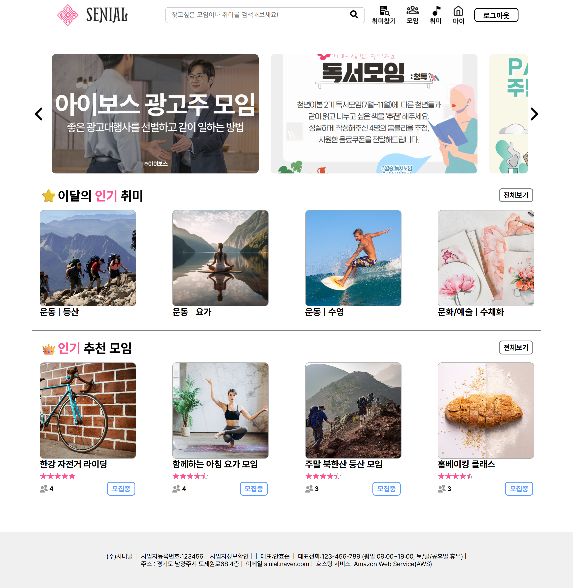 | 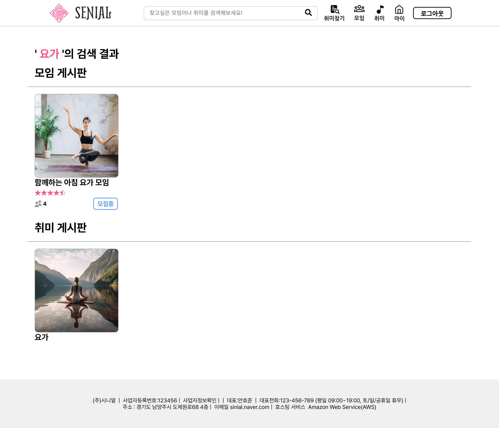 |

<br>

### [맞춤 취미 추천]

- 신체적 특성, 예산, 난이도, 성향 네 가지를 선택하면 맞춤 취미를 추천해 줍니다.
- 추천받은 취미를 바로 내 관심사로 등록할 수 있습니다.
- 추천 취미와 연결된 모임도 이어서 확인할 수 있습니다.

| 추천 입력 | 추천 결과 |
| :---: | :---: |
| 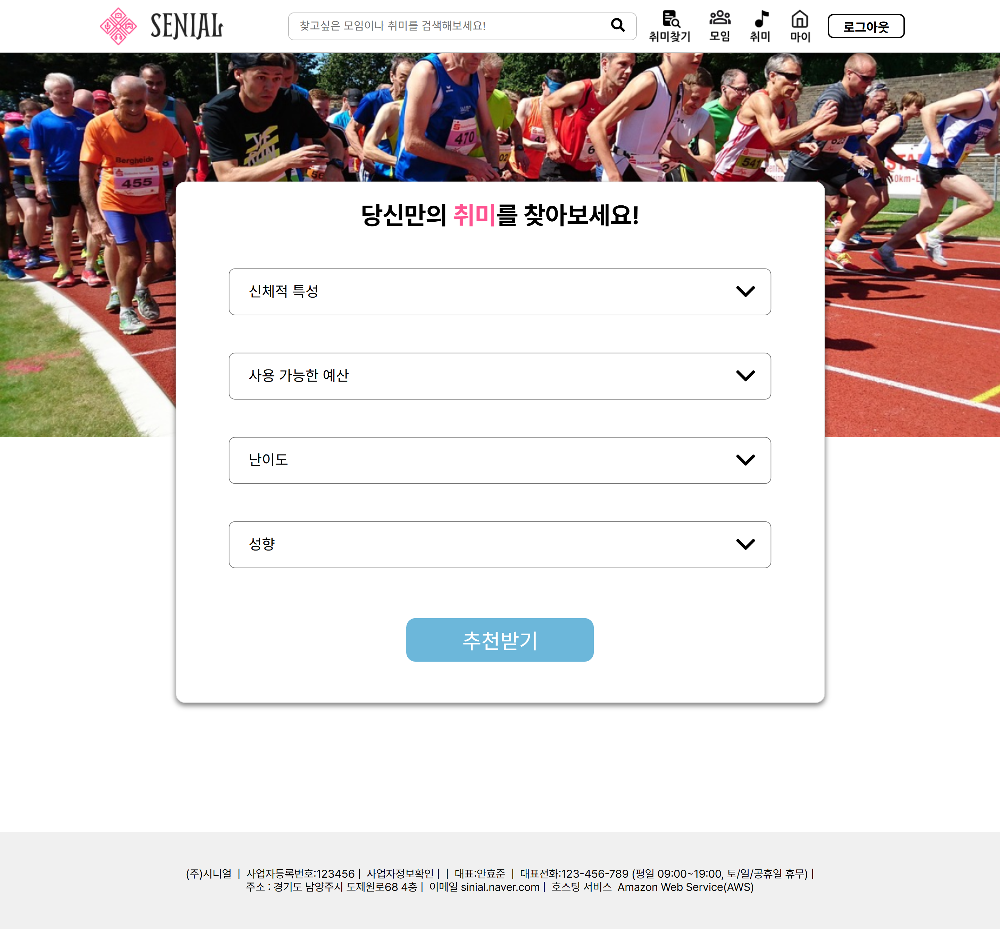 | 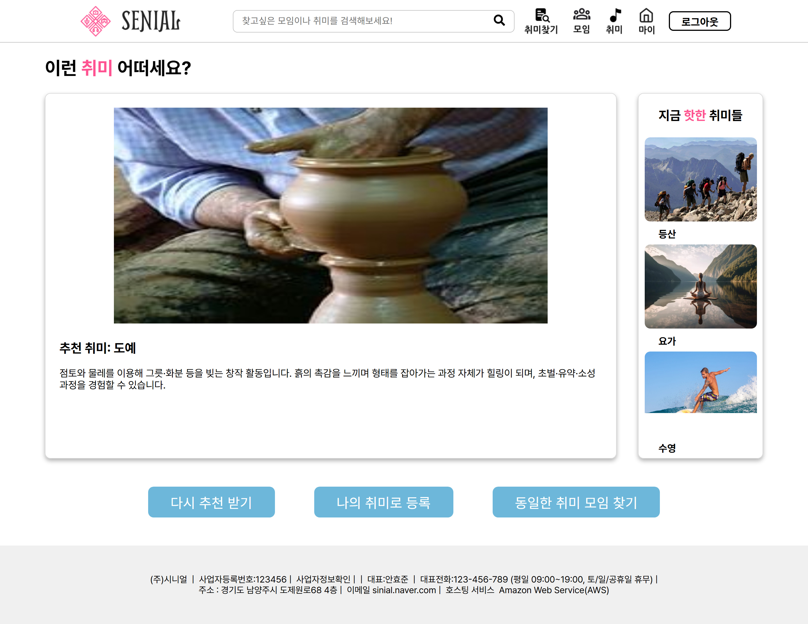 |

<br>

### [매칭 게시판 (모임)]

- 카테고리와 키워드로 원하는 모임을 검색합니다.
- 대표 이미지를 올려 모임을 만들고, 수정하거나 삭제할 수 있습니다.
- 모임에 가입·탈퇴하고, 방장은 멤버를 내보낼 수 있습니다.
- 모임 상세에서 일정, 후기, 멤버를 한눈에 확인합니다.
- 모임 일정을 등록하면 참여자의 캘린더에 함께 표시됩니다.
- 활동이 끝난 모임에는 별점과 함께 후기를 남길 수 있고, 마음에 드는 모임은 찜할 수 있습니다.

**모임 목록**

| 매칭 게시판 |
| :---: |
| 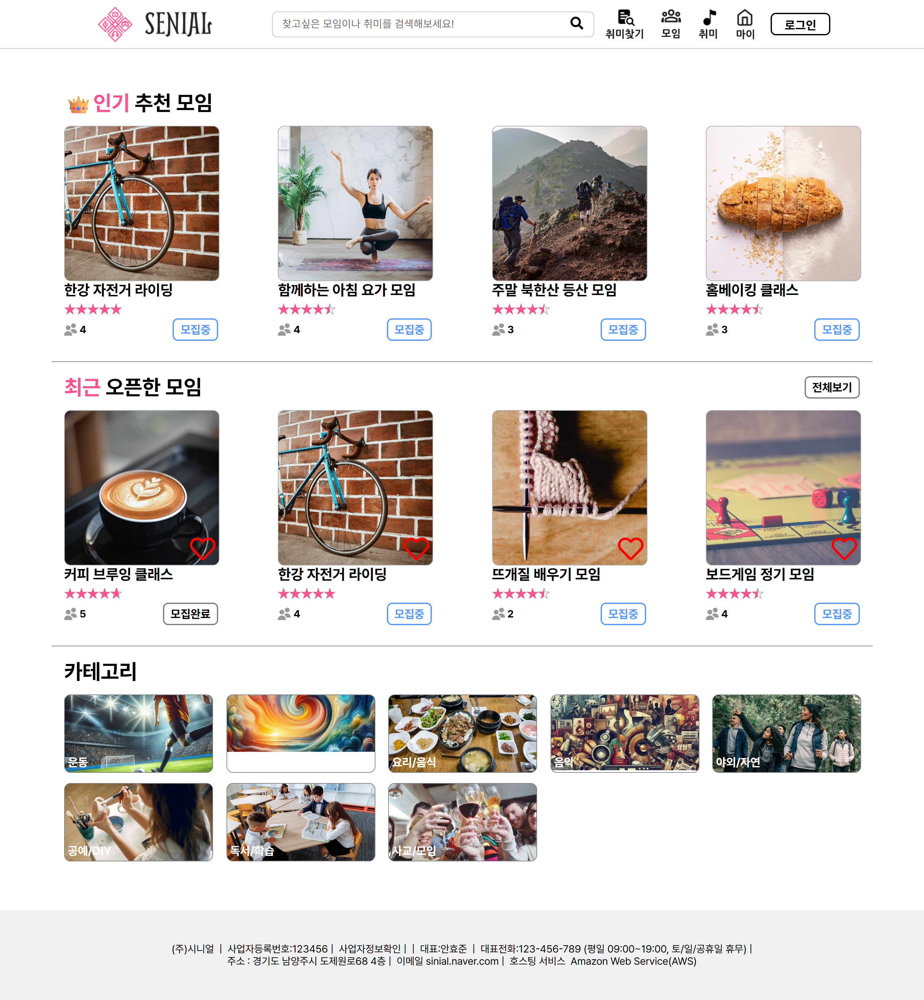 |

**모임 상세** — 대표 이미지, 일정, 후기, 멤버, 추천 모임을 한 페이지에서 보여 줍니다.

| 모임 상세 |
| :---: |
| 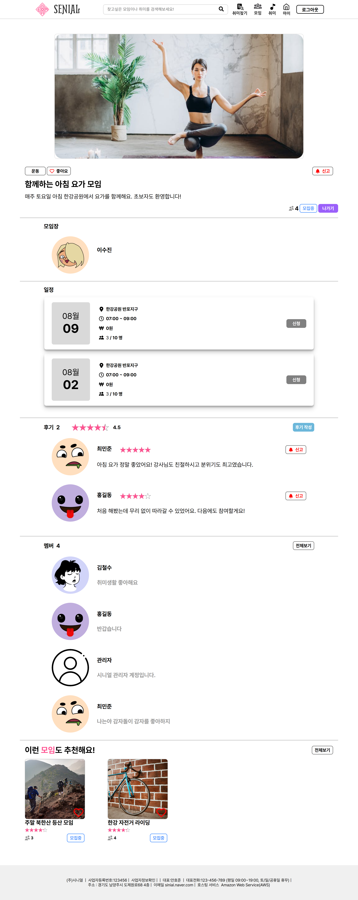 |

<br>

### [취미 게시판]

- 카테고리별로 다양한 취미를 둘러봅니다.
- 평점을 기준으로 인기 취미 TOP 3를 보여 줍니다.
- 취미 상세에서 설명과 선호도, 후기를 확인하고 별점 후기를 남길 수 있습니다.
- 마음에 드는 취미와 연결된 모임을 바로 찾아갈 수 있습니다.

| 취미 목록 | 취미 상세 |
| :---: | :---: |
| 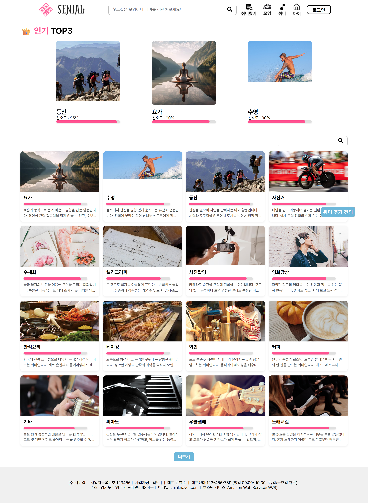 | 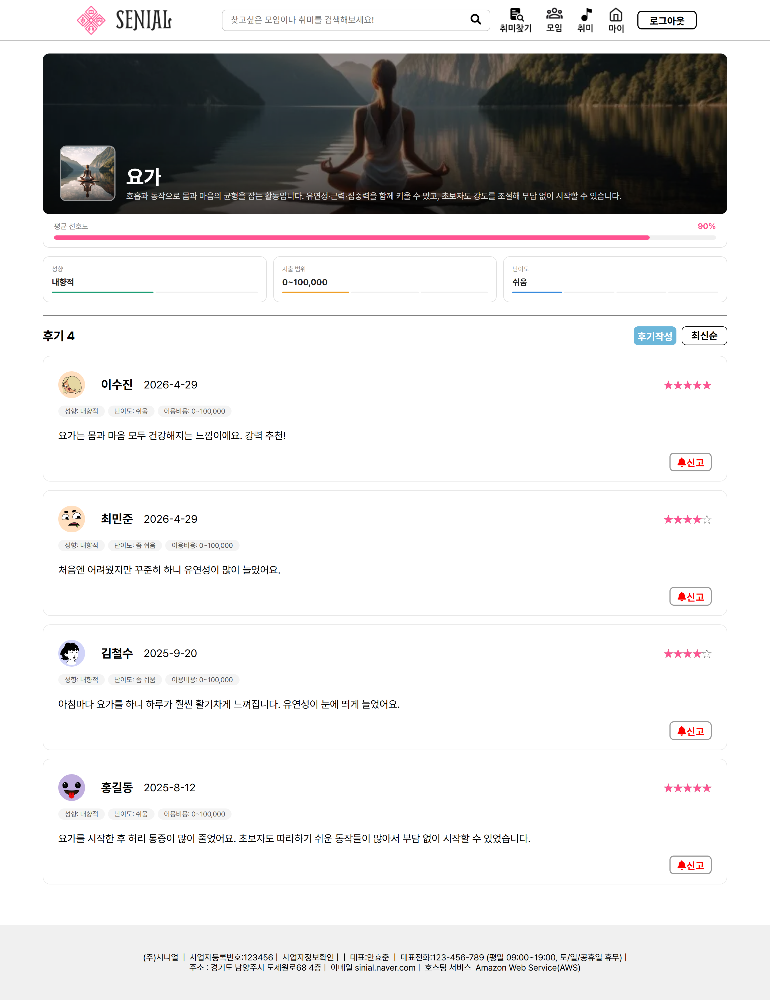 |

<br>

### [마이페이지 + 캘린더]

- 프로필을 조회·수정하고 프로필 사진을 등록합니다.
- 참여한 모임, 내가 만든 모임, 찜한 모임을 한곳에서 관리합니다.
- 관심사(취미)를 설정해 추천과 모임 매칭에 반영합니다.
- 참여한 모임 일정을 캘린더에서 한눈에 확인합니다.

| 마이페이지 + 캘린더 |
| :---: |
| 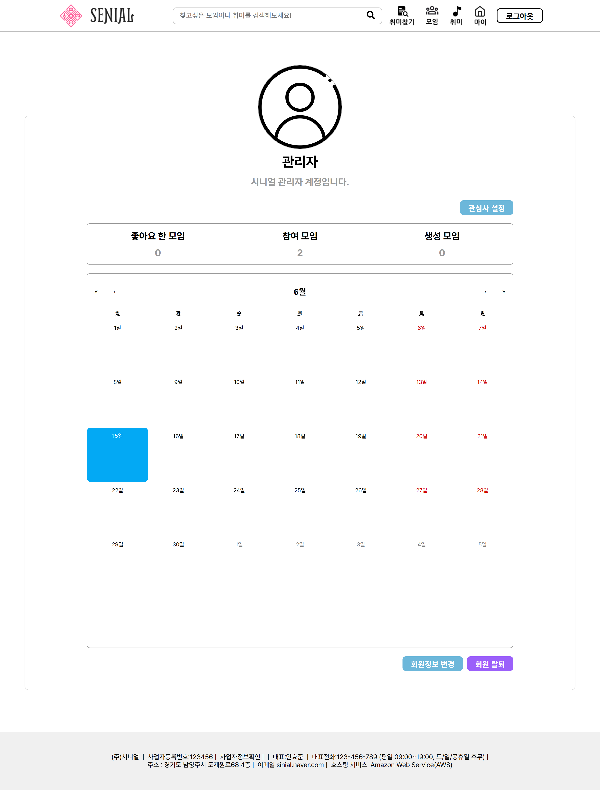 |

<br>

### [관리자 기능]

- 사용자 목록을 보고 활동 정지·임시 정지·정지 해제를 처리합니다.
- 게시글과 후기에 들어온 신고를 확인하고 처리합니다.
- 사용자가 남긴 건의를 확인하고 관리합니다.
- 취미 카테고리를 관리합니다.

| 관리자 기능 |
| :---: |
| 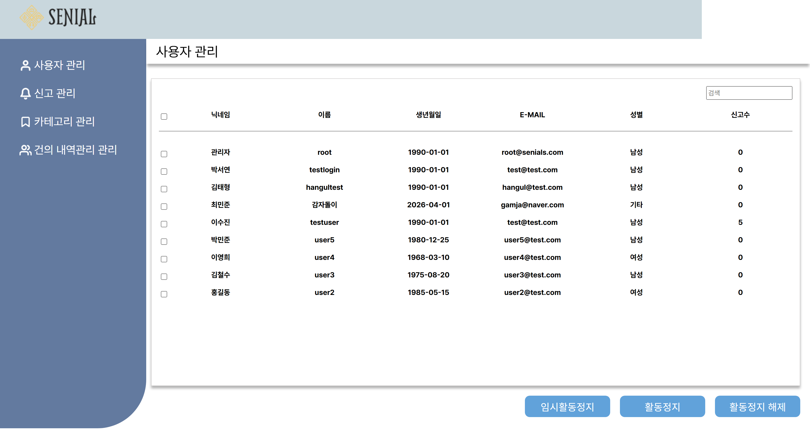 |

<br>

## 3. 시스템 아키텍처

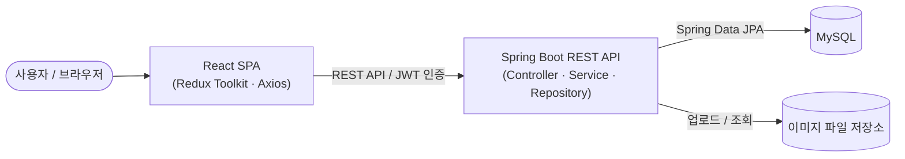
```mermaid
flowchart LR
    User([사용자 / 브라우저])
    FE["React SPA<br/>(Redux Toolkit · Axios)"]
    BE["Spring Boot REST API<br/>(Controller · Service · Repository)"]
    DB[("MySQL")]
    FILE[("이미지 파일 저장소")]

    User --> FE
    FE -- "REST API / JWT 인증" --> BE
    BE -- "Spring Data JPA" --> DB
    BE -- "업로드 / 조회" --> FILE
```

- 프론트엔드(React)와 백엔드(Spring Boot)를 분리하고, REST API로 통신합니다.
- 로그인 시 발급한 JWT 토큰을 요청 헤더에 담아 인증합니다.
- 데이터는 JPA를 통해 MySQL에 저장하고, 업로드한 이미지는 서버 파일 저장소에 보관합니다.

<br>

## 4. 시스템 흐름도

유저와 관리자의 동작이 각 화면을 거쳐 데이터로 이어지는 흐름입니다.

| 시스템 흐름도 |
| :---: |
| 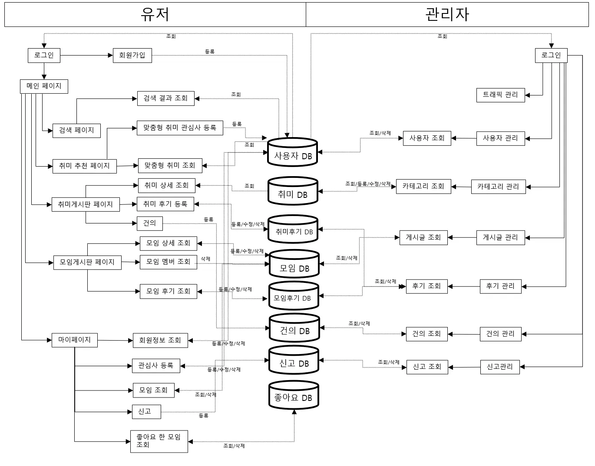 |

<br>

## 5. ERD

| ERD |
| :---: |
| 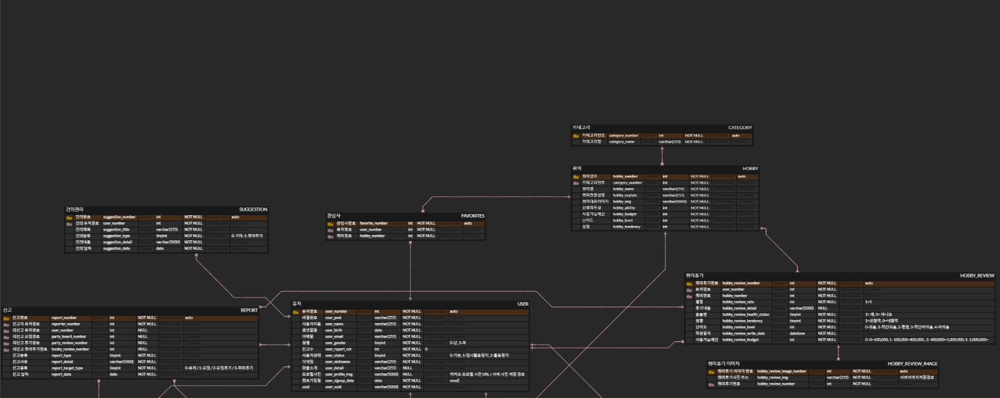 |
| 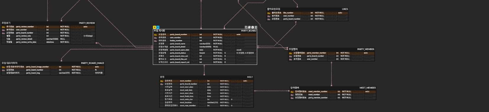 |

<br>

## 6. 프로젝트 구조

```
senials
├─ Senials-Backend        # Spring Boot REST API
│  └─ src/main/java/com/senials
│     ├─ config/          # 공통 설정 (CORS · 헤더 등)
│     ├─ security/        # JWT 인증·인가
│     ├─ common/          # 공통 응답·매퍼
│     ├─ user/            # 회원
│     ├─ partyboard/      # 모임 게시판
│     ├─ partymember/     # 모임 멤버
│     ├─ meet/            # 모임 일정
│     ├─ partyreview/     # 모임 후기
│     ├─ hobbyboard/      # 취미
│     ├─ hobbyreview/     # 취미 후기
│     ├─ category/        # 카테고리
│     ├─ favorites/       # 관심사
│     ├─ likes/           # 찜
│     ├─ report/          # 신고
│     ├─ suggestion/      # 건의
│     └─ partyboardimage/ # 이미지 업로드·조회
│
└─ Senials-Frontend       # React SPA
   └─ src
      ├─ pages/           # 화면 (메인 · 추천 · 모임 · 취미 · 마이 · 관리자 · 로그인 · 검색)
      ├─ layouts/         # 헤더 · 푸터 · 레이아웃
      ├─ redux/           # 상태 관리 (store · slices)
      └─ utils/           # 공통 유틸
```

> 백엔드의 각 도메인 패키지는 `controller · service · repository · entity · dto` 계층으로 나눠 구성했습니다.

<br>

## 7. API 명세

<details>
<summary>주요 API 펼쳐 보기</summary>

| 도메인 | 메서드 · 엔드포인트 | 설명 |
|--------|---------------------|------|
| 모임 | `GET /partyboards/recommended-parties` | 관심사 기반 추천 모임 |
| 모임 | `GET /partyboards/popular-parties` | 인기 모임 |
| 모임 | `GET /partyboards/search` | 모임 검색(카테고리/키워드) |
| 모임 | `POST /partyboards` | 모임 생성 |
| 모임 | `PUT /partyboards/{n}` · `DELETE /partyboards/{n}` | 모임 수정·삭제 |
| 모임 멤버 | `POST /partyboards/{n}/partymembers` | 모임 가입 |
| 모임 멤버 | `DELETE /partyboards/{n}/partymembers` | 모임 탈퇴 |
| 모임 멤버 | `PUT /partyboards/{n}/partymembers` | 멤버 강퇴(방장) |
| 모임 일정 | `GET/POST/PUT/DELETE /partyboards/{n}/meets` | 모임 일정 관리 |
| 모임 일정 | `GET /users/{n}/meets` | 내 일정(캘린더) |
| 모임 후기 | `GET/POST/PUT/DELETE /partyboards/{n}/partyreviews` | 모임 후기 |
| 찜 | `PUT /likes/partyBoards/{n}` | 찜 토글 |
| 취미 | `GET /hobby-board` · `GET /hobby-board/top3` | 취미 목록 · 인기 TOP3 |
| 취미 | `GET /hobby-detail/{n}` | 취미 상세 |
| 맞춤 추천 | `GET /suggest-hobby-result` | 맞춤 취미 추천 결과 |
| 맞춤 추천 | `POST /suggest-hobby-result` | 추천 취미 관심사 등록 |
| 관심사 | `GET/POST/PUT/DELETE /{userNumber}/favorites` | 관심사 관리 |
| 취미 후기 | `GET/POST/PUT/DELETE /{n}/hobby-review` | 취미 후기 |
| 회원 | `GET/PUT/DELETE /users/{n}` | 회원 조회·수정·탈퇴 |
| 회원 | `POST /users/{n}/profile/upload` | 프로필 이미지 업로드 |
| 검색 | `GET /search-whole/party` · `GET /search-whole/hobby` | 통합 검색 |
| 카테고리 | `GET /categories` | 카테고리 목록 |
| 신고 | `GET /reports` · `POST /reports` | 신고 조회·등록 |
| 건의 | `GET/POST/DELETE /suggestion` | 건의 관리 |
| 관리자 | `GET /users-manage` · `PUT /users` | 사용자 관리·상태 변경 |

</details>

<br>

## 8. 트러블슈팅

### 로그인은 됐는데 로그인 상태가 유지되지 않던 문제

- **문제** : 로그인 요청은 성공하는데 프론트엔드에서 토큰을 읽지 못해 계속 로그아웃 상태로 보였습니다.
- **원인** : 백엔드가 토큰을 응답 본문에 담는지 `Authorization` 헤더에 담는지 프론트와 약속이 맞지 않았습니다.
- **해결** : 응답 본문(`token`, `accessToken` 등)과 헤더를 순서대로 확인해 토큰을 찾고, JWT 형식이 맞는지 검증한 뒤 저장하도록 처리했습니다.

### 프론트에서 API 호출이 막히던 문제 (CORS)

- **문제** : React 화면에서 백엔드 API를 호출하면 브라우저가 요청을 막았습니다.
- **원인** : 프론트엔드와 백엔드의 출처(origin)가 달라 CORS 정책에 걸렸습니다.
- **해결** : 백엔드 설정(`WebConfig`)에서 허용 출처와 메서드, 헤더를 지정해 해결했습니다.

### 업로드한 이미지가 화면에 보이지 않던 문제

- **문제** : 모임 대표 이미지와 프로필 사진을 올려도 화면에 표시되지 않았습니다.
- **원인** : 업로드한 파일을 정적 경로로 바로 접근하기 어려웠습니다.
- **해결** : 파일을 서버에 저장하고, 이미지 전용 엔드포인트(`/img/...`)로 내려주도록 구현해 해결했습니다.

### 마이페이지로 이동할 때 사용자 번호를 매번 넘겨야 했던 문제

- **문제** : 마이페이지 경로(`/user/{userNumber}/...`)에 사용자 번호가 필요한데, 화면마다 들고 다니기 번거로웠습니다.
- **해결** : 로그인 시 저장한 JWT 토큰을 디코딩해 사용자 번호를 꺼내 경로를 만들도록 처리했습니다.
